# Analysis Results

### Story of the Dataset Analysis

In a world where literature connects hearts and minds, a dataset containing information about 10,000 books from various authors offers a treasure trove of insights into reading habits, preferences, and the literary landscape. This dataset, rich in details, provides a glimpse into the world of books—ranging from unique identifiers like `book_id`, `goodreads_book_id`, and `work_id`, to critical metrics such as `average_rating`, `ratings_count`, and the `original_publication_year`.

#### The Dataset

The dataset encompasses a wide array of attributes that paint a picture of the literary world. Among the notable columns are:

- **Authors**: A diverse group of 4,664 unique writers, showcasing a blend of genres and styles.
- **Average Rating**: Books enjoy an average rating of around 4.00, indicating a generally positive reception among readers. This metric, accompanied by the `ratings_count`, reveals not only the popularity of certain titles but also the engagement level of the readers.
- **Publication Years**: The `original_publication_year` spans a wide range, with books published as far back as 1750, alongside contemporary works. This dimension highlights the timeless nature of literature and the enduring impact of classic works.
- **Language Code**: The dataset includes books in various languages, with English being the predominant language, reflecting the dataset's focus on English-speaking audiences.

#### The Analysis

Visualizations such as correlation matrices and distribution plots were crafted to unravel patterns and relationships within the data. The correlation matrix provided insights into how different metrics relate to one another, particularly highlighting the strong positive correlation between `ratings_count` and `average_rating`. This suggests that more popular books tend to receive higher ratings, a valuable insight for publishers and authors aiming to understand reader preferences.

Moreover, distribution plots revealed the skewness in ratings—many books receive a significant number of ratings concentrated in the 4-5 star range, indicating that readers are often more inclined to rate positively. Such insights are crucial for authors and publishers who seek to understand the factors that contribute to a book's success.

#### Insights Gained

1. **Popularity vs. Quality**: The analysis revealed that the most popular books (those with high `ratings_count`) are also those that maintain a high `average_rating`. This reinforces the idea that popularity does not necessarily compromise quality. It suggests that effective marketing and word-of-mouth can lead to a virtuous cycle of ratings and popularity.

2. **Diversity in Literature**: With 4,664 unique authors and a broad range of publication years, the dataset underscores the diversity in literature. This indicates a rich tapestry of narratives and styles, appealing to various reader demographics and preferences.

3. **Market Trends**: The analysis of publication years indicates a growing trend towards newer publications, which may reflect current societal interests and issues. This insight can inform publishers about which genres or themes are gaining traction among readers.

4. **Engagement with Classics**: The presence of older titles alongside contemporary works suggests that readers continue to engage with classic literature. This pattern emphasizes the importance of maintaining a balance between promoting new authors and preserving the value of literary heritage.

#### Implications

The insights derived from this dataset have broad implications for various stakeholders in the literary ecosystem:

- **Authors**: Understanding the relationship between ratings and popularity can guide authors in their marketing strategies and content creation, leading to more targeted approaches in reaching their audience.
  
- **Publishers**: The data can help publishers identify trends in reader preferences, allowing them to curate catalogues that resonate with current market demands while also promoting classic literature.

- **Readers**: For readers, the dataset serves as a guide to discovering new books and authors based on collective ratings and reviews, enhancing their reading experience.

- **Researchers**: Academics and literary scholars can leverage this data to study trends in literature, reader engagement, and the evolution of literary themes over time.

In conclusion, this dataset is not merely a collection of numbers and attributes; it tells a story of human experience, preferences, and the enduring power of literature. The analysis not only sheds light on current trends but also offers a roadmap for future exploration in the literary world, ensuring that the love for reading continues to flourish across generations.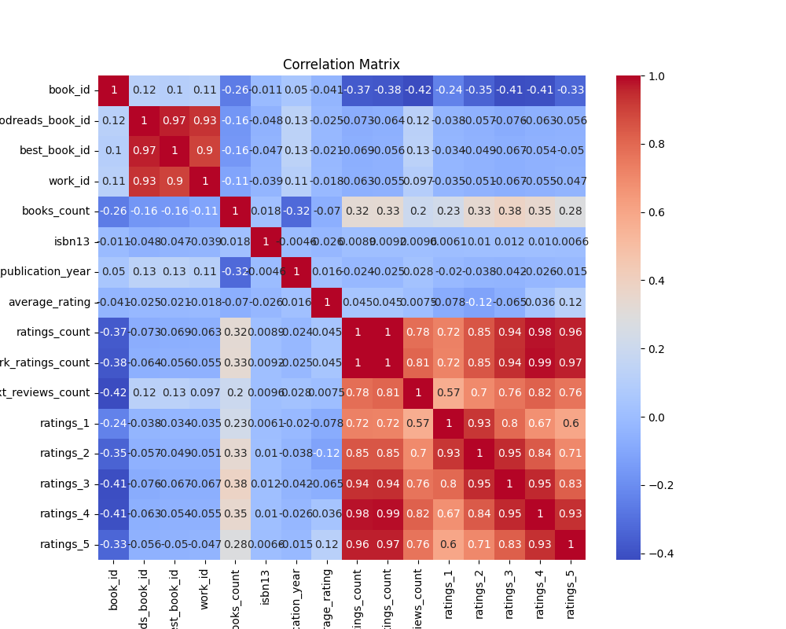
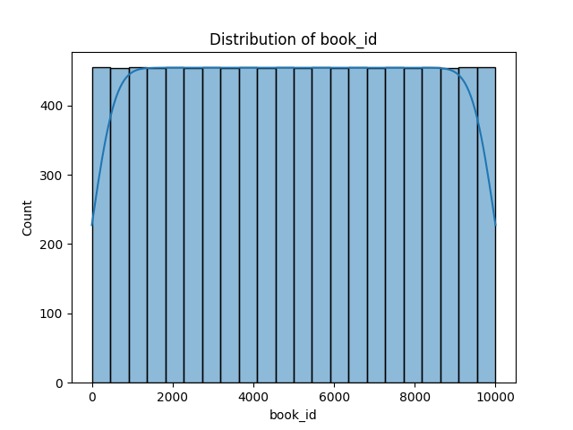
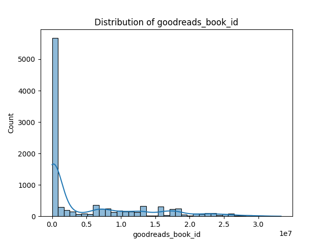
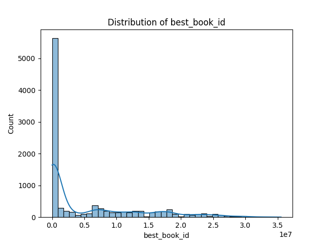
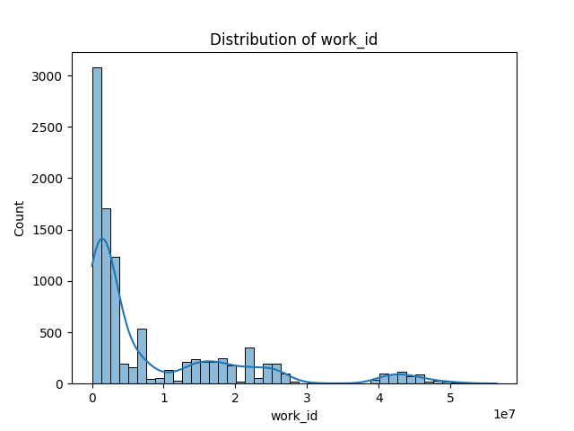
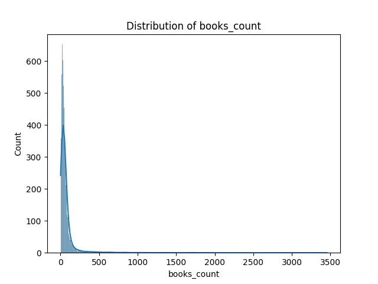
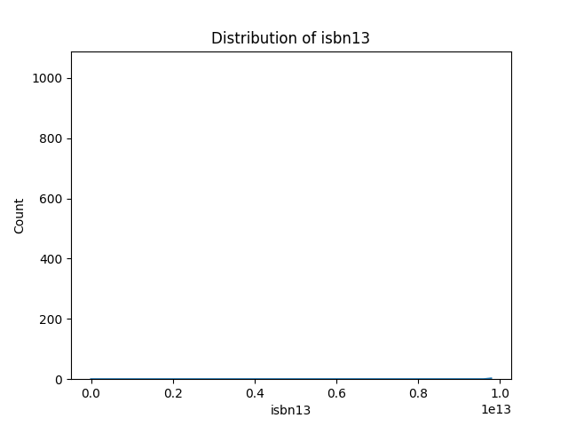
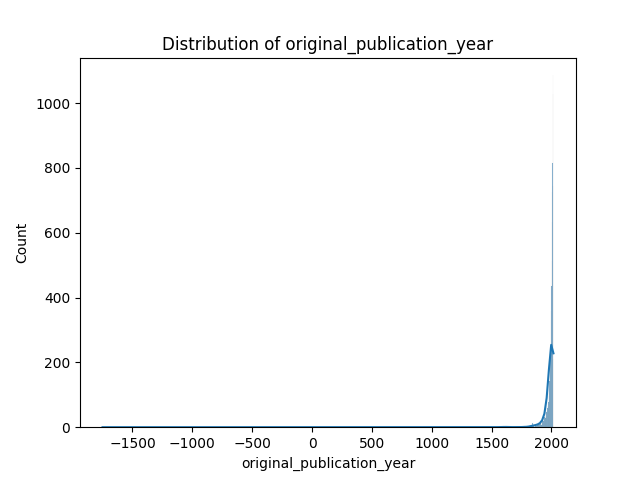
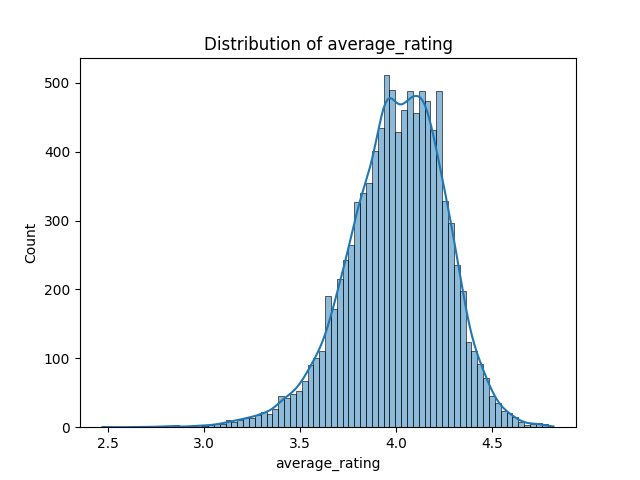
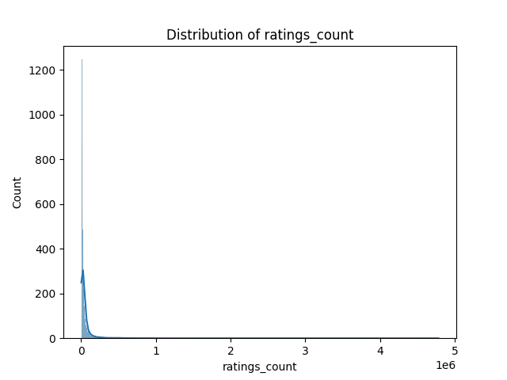
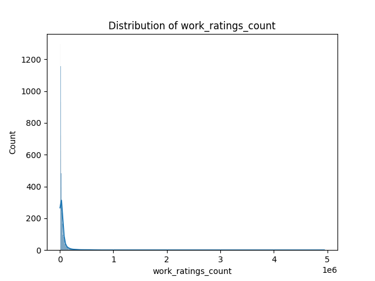
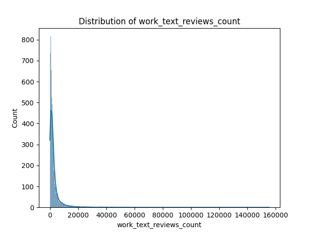
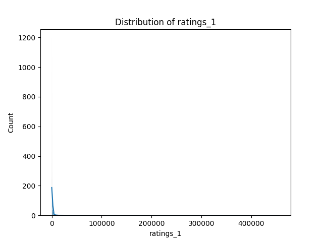
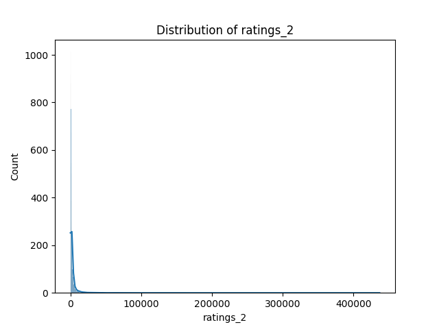
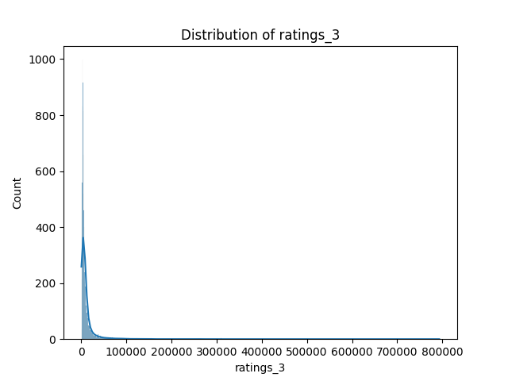
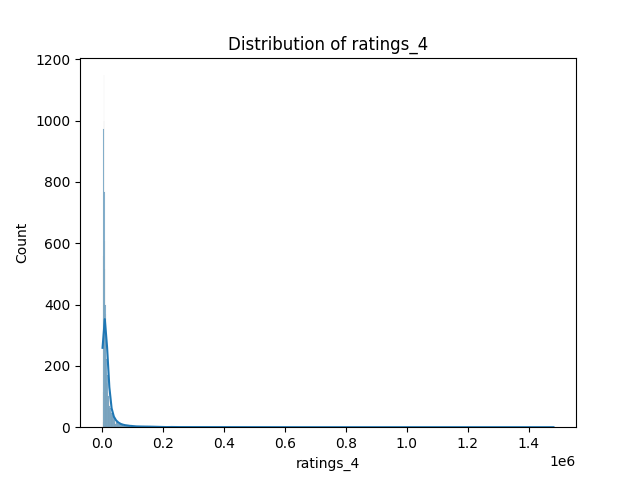
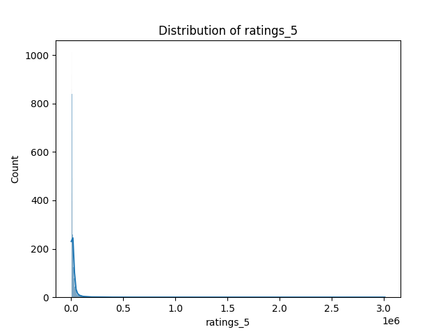
