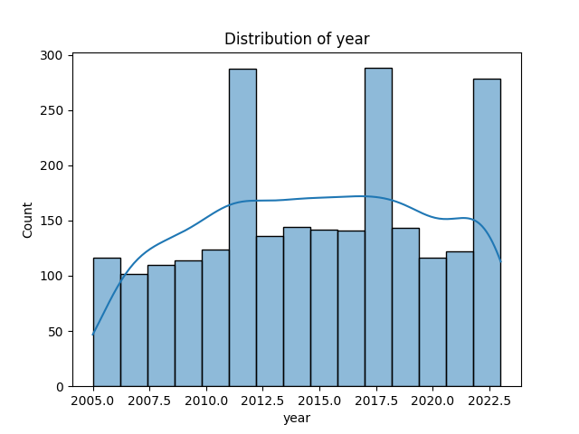
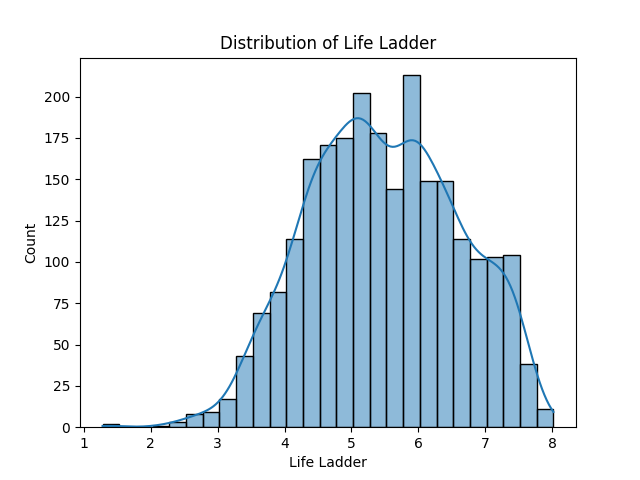
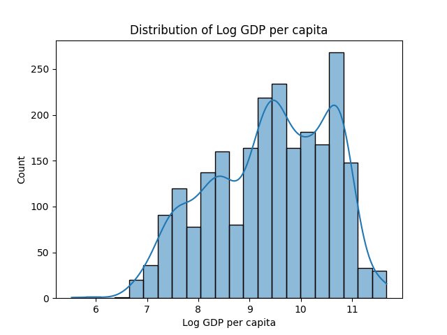
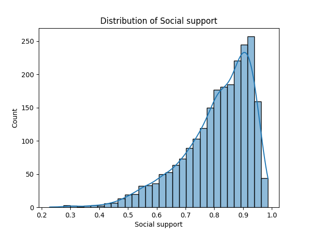
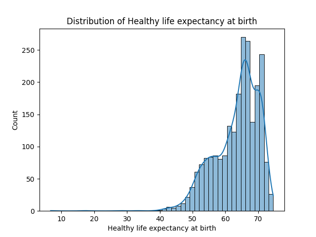
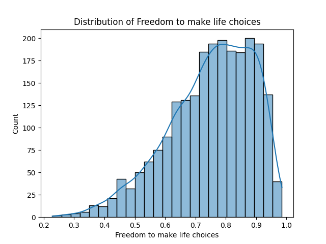
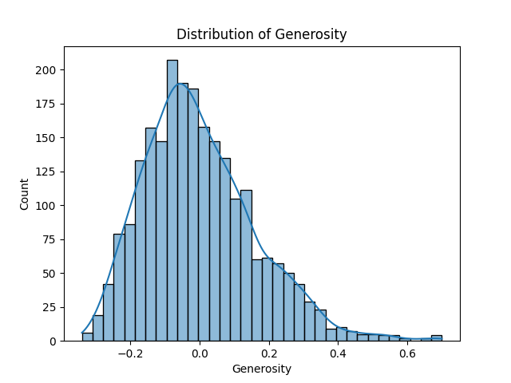
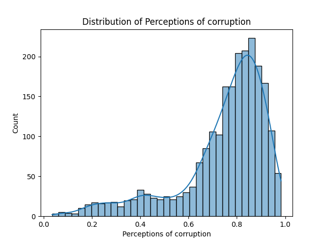
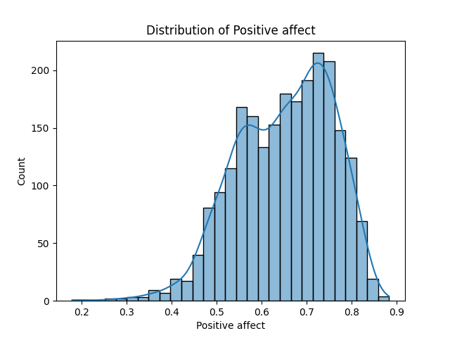
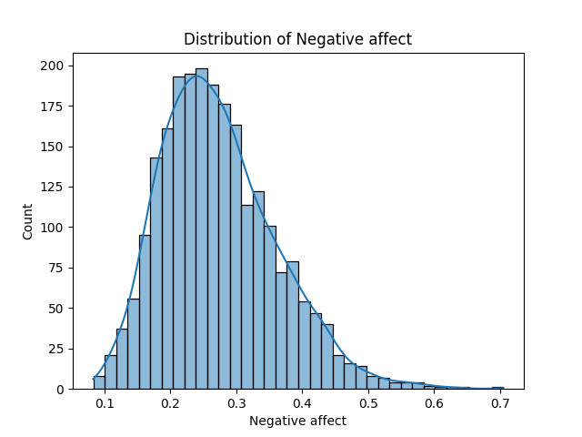

# Analysis Results

### Story of the Dataset Analysis

In a world where happiness and well-being are central to societal progress, the "happiness.csv" dataset offers an enlightening perspective on the factors influencing the quality of life across countries. This dataset spans a wide range of metrics, capturing key indicators of subjective well-being, economic development, and societal cohesion. By analyzing these attributes, we can uncover patterns and trends that illuminate the state of global happiness.

#### The Dataset

The dataset contains 2,363 entries and 11 attributes, each representing various dimensions of well-being. Key columns include:

- **Country name**: Covers a diverse set of nations, providing a global perspective on happiness.
- **Year**: Encompasses data from 2005 to 2023, allowing for temporal analysis of trends.
- **Life Ladder**: Reflects subjective well-being, with an average score of 5.48, indicating moderate happiness levels worldwide.
- **Log GDP per capita**: Measures economic prosperity, with values ranging from 5.53 to 11.68.
- **Social support**: Highlights the perceived availability of help, with an average score of 0.81.
- **Healthy life expectancy at birth**: Represents expected healthy years, averaging 63.4 years across countries.
- **Freedom to make life choices**: Reflects autonomy, with a mean score of 0.75.
- **Generosity**: Indicates societal altruism, showing a wide variance from -0.34 to 0.70.
- **Perceptions of corruption**: Captures trust in institutions, with an average score of 0.74.
- **Positive affect**: Represents the prevalence of positive emotions, averaging 0.65.
- **Negative affect**: Represents the prevalence of negative emotions, averaging 0.27.

#### The Analysis

Visualizations such as correlation matrices and temporal trends were used to extract meaningful insights. The correlation matrix highlighted strong relationships among economic, health, and well-being metrics. Notable observations include:

1. **GDP and Well-being**: A strong positive correlation between "Log GDP per capita" and "Life Ladder" underscores the influence of economic prosperity on happiness.
2. **Social Support**: Countries with higher "Social support" tend to report higher "Life Ladder" scores, emphasizing the importance of community and relationships.
3. **Health Metrics**: "Healthy life expectancy" correlates positively with "Life Ladder," indicating that longevity and well-being are intertwined.

Temporal analyses revealed trends such as improving life expectancy over time and varying levels of happiness influenced by global events.

#### Insights Gained

1. **Economic Prosperity and Happiness**: Higher GDP per capita is strongly associated with higher subjective well-being, highlighting the role of economic security.
2. **Social Cohesion**: Strong social support networks significantly enhance happiness, reinforcing the need for societal investments in community building.
3. **Trust and Corruption**: Lower perceptions of corruption align with higher happiness scores, suggesting that institutional trust is a key determinant of well-being.
4. **Emotional Balance**: Countries with lower "Negative affect" and higher "Positive affect" scores report better overall happiness.

#### Implications

The findings from this dataset provide valuable insights for policymakers, researchers, and societal leaders:

- **Policymakers**: Investing in health, economic stability, and social support can drive national happiness levels.
- **Researchers**: The dataset offers a foundation for studying the interplay of economic, social, and emotional factors in shaping well-being.
- **Global Institutions**: Insights can guide international development programs focused on reducing inequalities and fostering trust.

#### Conclusion

This dataset serves as a window into the multifaceted nature of happiness, revealing how diverse factors converge to shape human well-being. The analysis highlights the importance of fostering economic prosperity, social support, and trust to build happier societies. As nations strive to improve their quality of life, this dataset offers a roadmap for understanding and enhancing global happiness.

