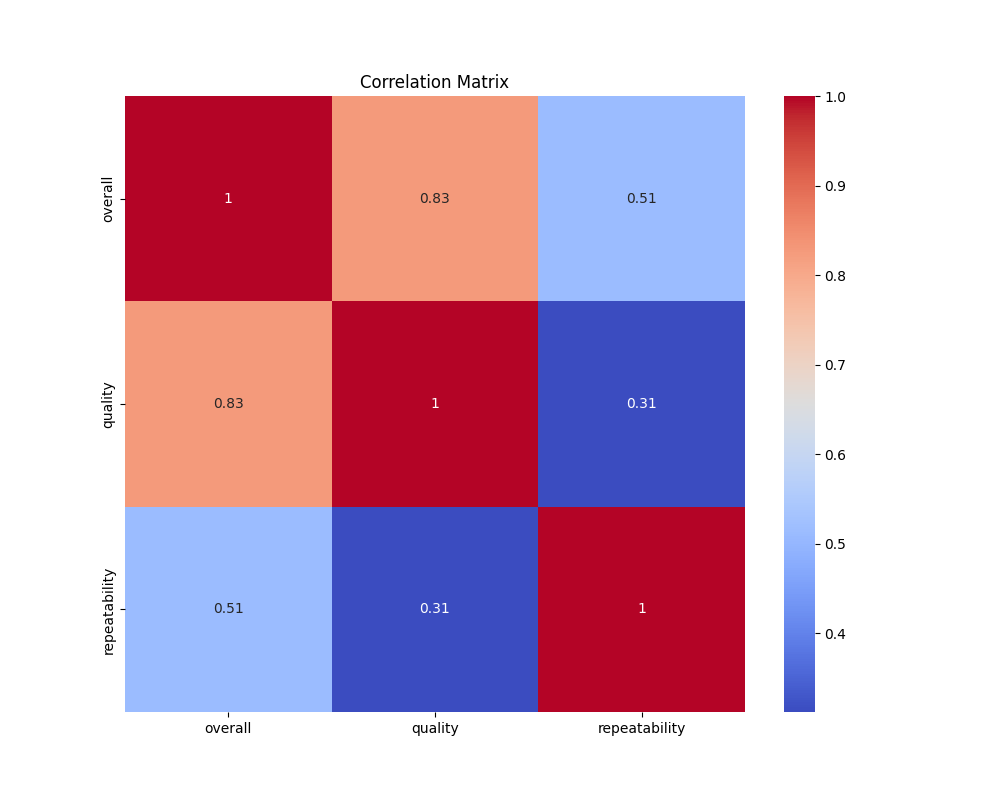
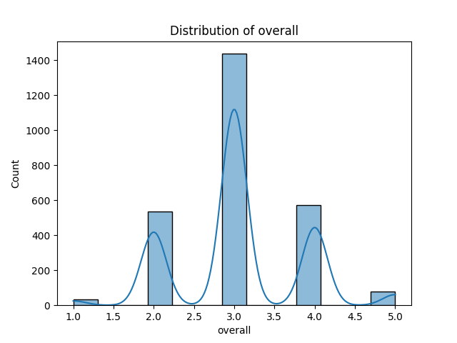
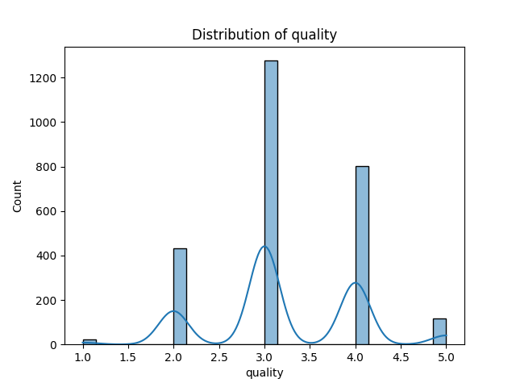
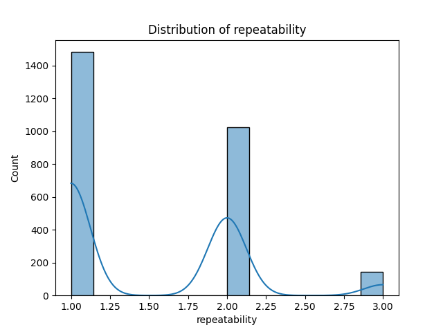

# Analysis Results

### Story of the Dataset and Analysis

In the world of entertainment, understanding viewer preferences and content quality is pivotal for producers, streaming services, and marketers. The dataset at hand encapsulates a wealth of information about various films and series, providing a glimpse into the dynamics of audience reception and content characteristics.

#### Dataset Overview

The dataset comprises 2,652 entries, each representing a title, with attributes that include the release date, language, type (e.g., movie, series), title, creators, and ratings on three critical dimensions: overall quality, specific quality measures, and repeatability of enjoyment. 

#### Key Findings from the Analysis

1. **Diversity of Titles**: The dataset showcases a broad range of titles (2,312 unique entries), indicating a rich diversity in content offerings. This suggests a vibrant landscape for content creators, with numerous opportunities to explore different genres and narratives.

2. **Language Representation**: The dataset spans across 11 languages, with English being the most represented language (1,306 entries). This highlights the dominance of English language content in this dataset, although other languages like Tamil and Telugu also feature prominently. Such linguistic diversity may cater to varied audience segments and preferences.

3. **Content Types**: The analysis reveals that 'movies' are the predominant content type (2,211 entries), suggesting a strong preference or availability of feature-length films compared to series and short formats. This could reflect audience consumption patterns, where viewers may lean towards longer narratives for deeper engagement.

4. **Rating Insights**: The overall average rating for titles is approximately 3.05 out of 5, with a standard deviation of 0.76. This indicates a moderate reception from audiences, with ratings clustering around the average. Meanwhile, the quality ratings average at 3.21, suggesting that while viewers may find the content decent, there is ample room for improvement.

5. **Repeatability of Enjoyment**: The repeatability rating averages at 1.49, with a mode of 1, which could imply that many titles do not resonate strongly enough with audiences to warrant re-watching. This metric is crucial for understanding audience loyalty and satisfaction, indicating that creators might need to enhance the emotional or narrative depth of their offerings to foster repeat viewership.

6. **Missing Data Implications**: The presence of missing values, particularly in the 'date' and 'by' columns (99 and 262 respectively), signals potential gaps in the dataset that could skew analysis. Addressing these missing values through imputation or further data collection could provide a more nuanced understanding of trends over time and creator popularity.

#### Visual Insights

The correlation matrix and distribution plots created during the analysis provided visual representations of relationships between variables. For instance, a strong correlation between 'overall' and 'quality' ratings might suggest that enhanced production quality directly influences viewer satisfaction. The distribution plots revealed how ratings are spread across different titles, highlighting potential clusters of high-performing and low-performing content.

#### Conclusions and Implications

The insights gleaned from this dataset hold significant implications for stakeholders in the entertainment industry. 

- **For Content Creators**: Understanding the factors that lead to higher ratings and repeatability can guide creators in their storytelling approaches, potentially fostering stronger connections with audiences.

- **For Marketers**: A deeper analysis of language and type preferences can help tailor marketing strategies to specific audience segments, enhancing engagement and viewership.

- **For Streaming Platforms**: Recognizing trends in content performance can inform acquisition strategies, helping platforms curate their libraries to better match audience tastes.

In conclusion, this dataset serves as a potent tool for understanding audience preferences and content quality in the entertainment industry. By leveraging these insights, stakeholders can make informed decisions that enhance viewer satisfaction and drive success in a competitive market.

